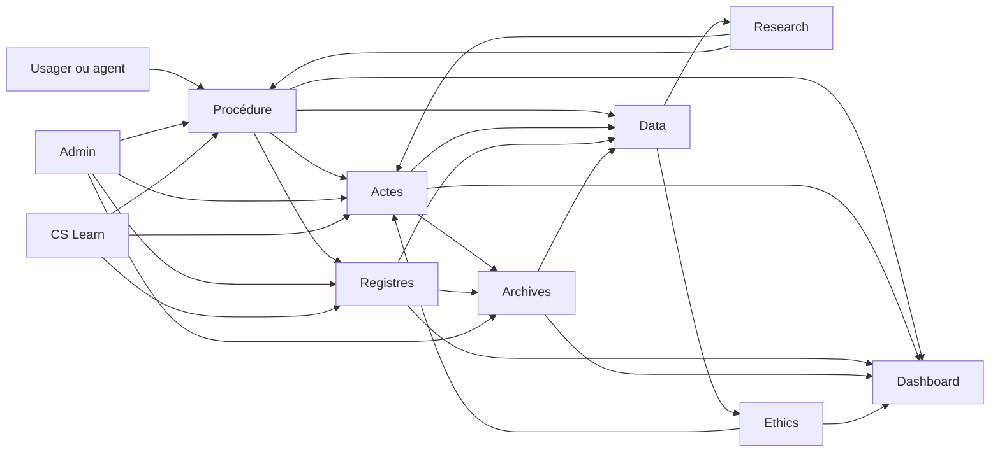
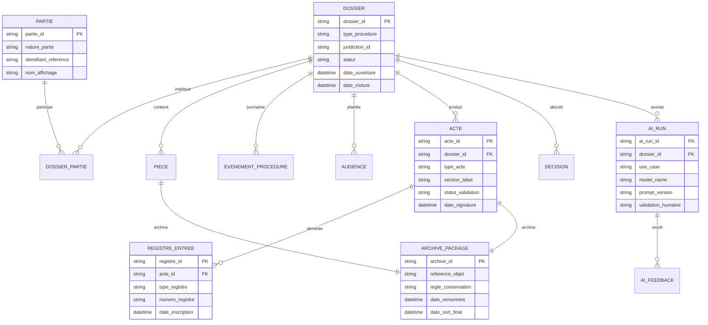
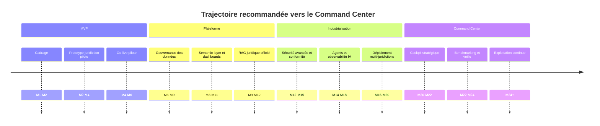

# Documentation complète pour construire un écosystème de gouvernance numérique de la justice à partir du SDGCC et de CS GREFFE OS

## Résumé exécutif

Le présent rapport propose une documentation-cadre pour transformer **CS GREFFE OS** en un **écosystème complet de gouvernance numérique appliqué à la justice**, en le traitant comme la transposition sectorielle, pour la justice, de la logique du **Strategic Doctoral Governance Command Center** : gouvernance par la preuve, orchestration des processus, observabilité, recherche, pilotage et amélioration continue. Cette base conceptuelle est une **prémisse de travail issue de votre documentation interne non publiée** ; elle n’est donc pas vérifiable publiquement et doit être lue comme un cadrage de projet, non comme un fait documentaire externe.

Le contexte institutionnel ivoirien rend ce projet particulièrement pertinent. La Côte d’Ivoire a engagé une digitalisation effective des actes de justice : en février 2025, le gouvernement a annoncé une plateforme de sécurisation et de digitalisation des documents de justice, alors en phase pilote à Dabou et Yopougon, avec un objectif de déploiement national ; la plateforme visait déjà la délivrance du certificat de nationalité en 72 heures et l’extension au casier judiciaire. En avril 2026, 16 nouvelles juridictions ont été raccordées, portant à 28 le nombre de juridictions connectées à la plateforme e-justice. En parallèle, les autorités ivoiriennes publient des indicateurs utiles de performance judiciaire, dont un taux de traitement des dossiers juridictionnels de 74,1 % en 2023 et un taux de couverture territoriale de 42,6 % en 2025. citeturn25view1turn25view2turn25view3

Sur le plan normatif, le projet s’inscrit dans un socle solide mais exigeant. En Côte d’Ivoire, la loi n° 2013-450 relative à la protection des données personnelles impose des formalités de déclaration préalable, des autorisations pour certains traitements sensibles, des obligations de finalité, de proportionnalité, d’exactitude, de confidentialité et de sécurité, ainsi qu’un encadrement strict des transferts internationaux ; elle interdit aussi qu’une décision de justice, administrative ou privée impliquant une appréciation du comportement humain repose **sur le seul fondement d’un traitement automatisé**. Le droit ivoirien encadre également les transactions électroniques, l’écrit et la signature électroniques, ainsi que l’archivage électronique. Du côté OHADA, l’Acte uniforme portant organisation du droit commercial général intègre explicitement le **RCCM**, les **fichiers nationaux et régionaux** et surtout un **Livre 5** consacré à l’informatisation, à la validité, à la conservation et à la transmission électronique des documents. citeturn21view2turn22view0turn22view1turn22view2turn12search2turn11search0turn35search1turn26view0turn27view0turn42search5

La recommandation centrale du rapport est donc la suivante : construire une plateforme **Snowflake-native** articulée en quatre couches de données — **raw**, **curated**, **semantic** et **AI** — et dix modules métier — **CS Learn, Procédure, Actes, Registres, Archives, Dashboard, Ethics, Data, Admin, Research**. Cette architecture doit combiner, d’un côté, des pipelines ELT gouvernés par **Snowpipe**, **dynamic tables**, **streams/tasks** selon le cas d’usage, et de l’autre, une couche d’assistance IA fondée sur **Semantic Views + Cortex Analyst** pour les données structurées, **Cortex Search + embeddings** pour la recherche documentaire juridique, **Cortex Agents** pour l’orchestration multi-agent, **Streamlit in Snowflake** pour les cockpits et **Horizon Catalog** pour la gouvernance, la classification, le lineage, le masquage et l’audit. citeturn13view1turn13view2turn13view3turn30view0turn18view0turn18view1turn18view2turn18view4turn13view6turn13view5turn13view4turn14view0turn13view7turn13view8

Enfin, la trajectoire recommandée est incrémentale. Un **MVP** doit d’abord industrialiser l’entrée des dossiers, la gestion procédurale, la rédaction assistée des actes et l’archivage probatoire. Une seconde phase doit consolider la plateforme métier et le socle de gouvernance des données. Une troisième phase doit industrialiser le RAG juridique, l’observabilité IA, la sécurité et la conformité. La quatrième phase doit faire émerger un véritable **Command Center** décisionnel, combinant pilotage des juridictions, qualité des actes, performance opérationnelle, conformité, suivi IA et veille juridique officielle. Cette progression est cohérente avec les stratégies nationales ivoiriennes de gouvernance des données et d’intelligence artificielle, qui mettent l’accent sur la gouvernance, l’interopérabilité, les infrastructures, la culture et l’éthique, la souveraineté numérique et les mécanismes de suivi. citeturn39view0turn39view3turn38view0turn38view2turn38view3

## Contexte et vision 2035

La logique d’origine du chantier peut être formulée simplement : **le SDGCC est ici traité comme un prototype méthodologique de gouvernance**, tandis que **CS GREFFE OS** devient son adaptation à la chaîne de valeur judiciaire. Cela signifie que l’objectif n’est pas seulement de dématérialiser des formulaires, mais de produire un **système de justice pilotable**, traçable, auditable, interopérable et apprenant, dans lequel chaque dossier, acte, registre, archive, indicateur et recommandation IA s’insère dans une chaîne de responsabilité explicite.

L’environnement national confirme cette direction. La Côte d’Ivoire a engagé une modernisation concrète des actes de justice et de leur délivrance numérique, avec des objectifs explicites d’accès équitable, de sécurisation des services judiciaires, de confiance des citoyens et d’extension à l’ensemble des juridictions du pays. Le ministère de la Justice indique que la dématérialisation doit réduire la lenteur, limiter la manipulation manuelle des documents et standardiser la célérité de traitement quelle que soit la juridiction. citeturn25view1turn25view2

L’environnement OHADA est lui aussi favorable à une approche plateforme. L’Acte uniforme relatif au droit commercial général organise le **Registre du Commerce et du Crédit Mobilier**, les **fichiers nationaux** et le **fichier régional** ; il formalise également l’**informatisation** du registre, la **validité des documents électroniques**, les **signatures électroniques**, la **conservation** et la **transmission** électronique des documents. Le portail RCCM rappelle en outre que l’immatriculation est une formalité personnelle et unique, véritable “acte de naissance” économique, et qu’elle est prise en charge au greffe de la juridiction compétente. citeturn26view0turn27view0turn27view1turn42search5

La vision cible à l’horizon 2035 peut donc être formulée comme suit : **faire de CS GREFFE OS une infrastructure de confiance pour la justice**, capable de gouverner l’ensemble du cycle de vie de l’information judiciaire, depuis la collecte et la qualification jusqu’à la décision, l’archivage, l’audit, la statistique et la veille. Cette vision est cohérente avec la **Stratégie Nationale de la Gouvernance des Données de la Côte d’Ivoire**, structurée autour de six axes — développement des compétences, gouvernance des données, innovation, interopérabilité et accessibilité, infrastructures, culture et éthique — et avec la **Stratégie Nationale de l’Intelligence Artificielle**, qui insiste sur la gouvernance inclusive, la transparence, la sécurité, la souveraineté numérique et les mécanismes de suivi. citeturn39view0turn39view2turn39view3turn38view0turn38view2turn38view3

La philosophie directrice doit rester explicitement **human-centric**. Les principes les plus robustes et les plus adaptés au domaine judiciaire sont convergents : la CEPEJ a défini cinq principes structurants pour l’IA dans les systèmes judiciaires — droits fondamentaux, non-discrimination, qualité et sécurité, transparence, maîtrise par l’utilisateur ; l’UNESCO place les droits humains, la dignité, la transparence, l’équité et la responsabilité humaine au cœur de l’éthique de l’IA ; le NIST AI RMF structure la gouvernance autour des fonctions **GOVERN**, **MAP**, **MEASURE** et **MANAGE**. Pour la justice, cela implique une règle simple : **l’IA doit assister, jamais se substituer à la fonction juridictionnelle ou au contrôle du greffe**. citeturn28view2turn29view1turn29view0

Les principes directeurs recommandés pour la plateforme sont les suivants.

| Principe | Traduction opérationnelle dans CS GREFFE OS |
|---|---|
| Primauté du droit | Toute automatisation doit être paramétrée par des règles juridiques et procédurales identifiées |
| Human-in-the-loop | Aucune émission finale d’acte, recommandation de qualification ou alerte critique sans validation humaine explicite |
| Donnée comme preuve | Toute sortie métier ou IA doit être rattachée à des sources, versions, horodatages et journaux d’accès |
| Souveraineté et minimisation | Les données ne sont collectées, partagées et conservées qu’au niveau nécessaire à la finalité |
| Interopérabilité contrôlée | Les échanges entre juridictions, registres et partenaires sont standardisés, tracés et gouvernés |
| Auditabilité intégrale | Toute action applicative, transformation de données, usage IA et publication de tableau de bord doit être reconstruisible |
| Évolution incrémentale | La plateforme progresse du MVP au Command Center, sans “big bang” institutionnel |

Les hypothèses de cadrage non précisées par votre demande doivent rester visibles dès la documentation initiale.

| Élément de cadrage | Statut |
|---|---|
| Budget programme global | **Non spécifié** |
| Région cloud / exigences exactes de résidence des données | **Non spécifié** |
| Modèle d’hébergement souverain ou hybride | **Non spécifié** |
| Taille exacte de l’équipe produit/IT/Data/Legal | **Non spécifié** |
| Calendrier politique et ordre des juridictions pilotes | **Non spécifié** |
| Référentiel national de classification des données judiciaires | **À formaliser** |

## Architecture fonctionnelle et technique

L’architecture métier recommandée repose sur dix modules cohérents avec votre cible **CS GREFFE OS**. Ils ne doivent pas être pensés comme des applications isolées, mais comme des **domaines fonctionnels reliés par un modèle de données commun, des règles de sécurité transverses et une observabilité unifiée**.

| Module | Finalité | Entrées principales | Sorties principales |
|---|---|---|---|
| CS Learn | Formation, simulation, montée en compétences | Corpus de procédures, cas pédagogiques, historiques anonymisés | Parcours, évaluations, simulations d’audience |
| Procédure | Gestion du cycle de vie du dossier | Requêtes, pièces, événements, affectations | États procéduraux, échéances, alertes |
| Actes | Rédaction, validation, délivrance | Données du dossier, modèles, signatures | Actes signés, versions, preuves de délivrance |
| Registres | Tenue des registres et formalités | Actes, décisions, immatriculations, radiations | Registres, extraits, journaux de formalités |
| Archives | Conservation probatoire et records management | Actes, pièces, métadonnées, traces | Archives, règles de conservation, restitution |
| Dashboard | Pilotage stratégique et opérationnel | KPIs, logs, backlog, qualité, sécurité | Cockpits, alertes, rapports |
| Ethics | Gouvernance éthique et conformité IA | Logs IA, exceptions, incidents, biais | Avis, validations, blocages, plans d’action |
| Data | Catalogue, qualité, lineage, partage | Tables, vues, tags, métriques | Jeux de données gouvernés, métriques qualité |
| Admin | Paramétrage, RBAC, référentiels | Rôles, profils, nomenclatures, modèles | Paramètres, habilitations, journaux admin |
| Research | Veille juridique, jurisprudence, recherche documentaire | Textes, décisions, notes, référentiels | Dossiers de veille, synthèses, citations |

La logique de circulation recommandée est la suivante : **Procédure** devient le cœur transactionnel ; **Actes** et **Registres** assurent les productions de valeur juridique ; **Archives** garantit la conservation, la restitution et la preuve ; **Dashboard** et **Ethics** apportent la gouvernance ; **Data** et **Research** rendent la plateforme apprenante ; **Admin** et **CS Learn** stabilisent l’adoption et la pérennité.

Sur le plan technique, la proposition la plus robuste est une architecture **Snowflake-native** découpée en quatre couches.

| Couche | Rôle | Exemples d’objets |
|---|---|---|
| Raw | Atterrissage, copie fidèle, traçabilité d’origine | stages, landing tables, fichiers, métadonnées source |
| Curated | Normalisation, qualité, historisation maîtrisée | tables métier, dimensions, faits, règles qualité |
| Semantic | Modèle métier pour requêtes, KPIs, text-to-SQL | semantic views, vues sécurisées, métriques |
| AI | Recherche hybride, RAG, agents, observabilité | Cortex Search, embeddings, agents, traces IA |

Ce découpage est cohérent avec la documentation Snowflake. **Snowpipe** permet de charger les fichiers dès leur arrivée dans un stage, en micro-batches. **Dynamic tables** sont recommandées pour les pipelines SQL déclaratifs multi-étapes de type bronze/silver/gold ; **streams et tasks** restent préférables dès qu’il faut du **MERGE**, du SCD Type 2, de l’orchestration procédurale, des appels externes ou des logiques conditionnelles. Pour les documents judiciaires nativement numériques ou scannés, **AI_EXTRACT** permet d’extraire des entités, listes et tableaux, y compris en français. Pour la couche de restitution, **Streamlit in Snowflake** permet de déployer des applications analytiques et des cockpits sans sortir les données de Snowflake. citeturn13view1turn13view2turn30view0turn13view3turn18view0turn18view1turn13view4

Le schéma de données recommandé pour le noyau transactionnel peut s’organiser autour des entités suivantes.

| Table clé | Fonction |
|---|---|
| `DOSSIER` | Identifiant de dossier, type de procédure, juridiction, statut, dates clés |
| `PARTIE` | Personnes physiques ou morales impliquées, rôles procéduraux |
| `DOSSIER_PARTIE` | Relation dossier-partie, qualité, représentation |
| `PIECE` | Pièces versées, hash, source, classification, lien archive |
| `EVENEMENT_PROCEDURE` | Chronologie du dossier, actes de procédure, affectations, délais |
| `AUDIENCE` | Séances prévues/passées, formation de jugement, salle, résultat |
| `ACTE` | Brouillon, version validée, signature, délivrance, statut |
| `REGISTRE_ENTREE` | Ligne de registre, formalité, numéro, juridiction, état |
| `DECISION` | Nature, date, dispositif, liens dossier/actes/exécution |
| `ARCHIVE_PACKAGE` | Paquet probatoire archivé, règles de conservation, restitution |
| `JURISPRUDENCE_SOURCE` | Corpus de recherche et de veille |
| `AI_RUN` | Requêtes IA, modèle, prompt version, contexte, validation |
| `AI_FEEDBACK` | Évaluation humaine, groundedness, acceptation/refus |
| `ACCESS_AUDIT` | Journaux d’accès, usages, consultations sensibles |

La sécurité doit être conçue nativement dans le schéma. Snowflake combine **DAC**, **RBAC** et, marginalement, **UBAC** ; les privilèges sont affectés à des rôles, eux-mêmes attribués aux utilisateurs. La recommandation est donc de structurer l’habilitation autour de rôles métier — greffier, chef de greffe, magistrat, auditeur, administrateur sécurité, data steward, AI reviewer — complétés par des rôles techniques — ingestion, transformation, semantic, observability. Les colonnes sensibles doivent être protégées par **masking policies**, idéalement **tag-based masking**, et les restrictions territoriales ou fonctionnelles par **row access policies**. Le lineage, l’impact analysis et la facilitation de l’audit doivent être activés dès l’origine. citeturn13view0turn14view1turn14view2turn14view3turn13view8

## Couche IA, RAG et gouvernance des données

La couche IA recommandée doit séparer clairement **l’IA sur données structurées** et **l’IA sur documents non structurés**. Pour les questions de pilotage, d’activité, de charge, de stock ou de performance, la meilleure voie est **Semantic Views + Cortex Analyst**. Snowflake précise que les Semantic Views définissent entités métier, dimensions, faits, métriques et relations ; elles sont la voie recommandée pour les nouvelles implémentations avec Cortex Analyst, améliorent l’exactitude par des métadonnées riches, des relations explicites et des **verified queries**, et restent soumises aux privilèges standards de Snowflake. citeturn18view4turn15search0turn15search1turn15search6turn15search14

Pour la recherche documentaire — textes OHADA, notes de service, procédures, modèles d’actes, jurisprudence, décisions anonymisées, doctrine interne, manuels greffe, veille réglementaire — la bonne stratégie est un **RAG juridique hybride**. **Cortex Search** permet d’indexer du texte et des vecteurs, d’utiliser des embeddings calculés par Snowflake ou fournis par l’utilisateur, et de combiner les deux pour une récupération hybride. Pour l’extraction d’information à partir des pièces scannées ou natives, **AI_EXTRACT** est adapté aux documents en plusieurs langues, dont le français, et supporte l’extraction structurée d’entités, de listes et de tableaux. citeturn13view6turn18view2turn18view1turn18view0

L’orchestration recommandée est **multi-agent mais gouvernée**. **Cortex Agents** fournit un environnement agentique managé dans lequel l’agent raisonne, planifie, appelle des outils et exécute du code sous contrôle des privilèges Snowflake. La documentation permet d’y connecter des outils structurés via **Cortex Analyst**, des outils documentaires via **Cortex Search**, des outils personnalisés via procédures/UDF, voire du code Python exécuté dans un sandbox isolé. Dans CS GREFFE OS, cela se traduit naturellement par un **Agent de qualification**, un **Agent de complétude documentaire**, un **Agent de rédaction assistée**, un **Agent de registre**, un **Agent de veille juridique** et un **Agent de conformité éthique**, le tout supervisé par un routeur de contexte et un journal d’approbation humaine. citeturn13view5turn18view3

La production exige une vraie discipline de **LLMOps**. La version minimale viable comprend : versionnement Git des prompts et artefacts applicatifs, synchronisation de dépôts Git dans Snowflake, usage des instructions personnalisées des Semantic Views, dépôt de **verified queries** validées par les métiers, journalisation des runs IA, traçage des contextes récupérés, et campagnes comparatives de prompts/modèles. Snowflake prend déjà en charge une partie de cette chaîne : **Git repository clone** pour synchroniser le code ; **AI Function Studio** pour automatiser benchmark, sélection de modèle, optimisation de prompt et évaluation ; **AI Observability** pour tracer prompts, contexte récupéré, usage des outils, groundedness, answer relevance, latency, cost et comparer les configurations avant passage en production. citeturn14view5turn15search6turn15search12turn44view3turn44view0

Pour les modèles classiques de scoring, de détection d’anomalies ou de classification, la plateforme peut s’appuyer sur le **Snowflake Model Registry**, qui stocke les modèles comme objets de schéma, gère versions, métriques, métadonnées, RBAC et cycle de vie dev-to-prod, avec observabilité des performances et du drift. Cela ne remplace pas le contrôle des prompts des assistants génératifs, mais complète l’arsenal de gouvernance pour les cas d’usage non génératifs, par exemple la priorisation de backlog, la détection de dossiers incomplets ou la qualification de files d’attente. citeturn44view1turn44view2

La gouvernance IA doit reposer sur quatre garde-fous concrets. Premièrement, **prévention technique** : activer **Cortex AI Guardrails**, qui détecte les injections de prompt, tentatives de jailbreak et attaques indirectes dans les appels d’outils. Deuxièmement, **conception sémantique** : forcer les requêtes structurées à passer par des Semantic Views, enrichies de verified queries. Troisièmement, **observabilité permanente** : mesurer groundedness, relevance, coût, usage et latence à chaque run important. Quatrièmement, **validation humaine obligatoire** sur les sorties ayant une portée juridique, probatoire ou administrative. citeturn13view9turn18view4turn44view0

Cette exigence de validation humaine n’est pas seulement une bonne pratique ; elle est conforme à l’esprit des référentiels de justice et aux textes ivoiriens. La CEPEJ demande de bannir une approche prescriptive et de maintenir la maîtrise par l’utilisateur ; la loi ivoirienne sur les données personnelles interdit qu’une décision impliquant une appréciation du comportement humain soit fondée sur le seul traitement automatisé ; l’UNESCO insiste sur la responsabilité humaine ; le NIST AI RMF demande une gouvernance explicite couvrant l’ensemble du cycle de vie. Concrètement, **aucun acte, aucune qualification procédurale sensible, aucune priorisation disciplinaire, aucune recommandation de sanction ou de recevabilité ne doit être automatiquement validée par l’IA**. citeturn28view2turn22view1turn22view2turn29view1turn29view0

La gouvernance des données, enfin, doit être traitée comme un produit institutionnel à part entière. **Horizon Catalog** centralise classification, qualité, politiques de protection, AI Guardrails ; la **classification sensible** peut découvrir automatiquement les colonnes sensibles et leur appliquer tags et politiques ; les **data metric functions** permettent d’industrialiser les contrôles de qualité ; **Access History** et **Account Usage** assurent l’audit de l’accès et de l’usage ; le **lineage** facilite la conformité, l’analyse d’impact et la confiance. citeturn14view0turn32search0turn32search1turn32search2turn14view4turn17search1turn17search2turn13view8

## Roadmap, processus opérationnels et artefacts

La trajectoire recommandée comporte quatre phases. Les fourchettes ci-dessous sont des **estimations de cadrage** et non des engagements contractuels. Les coûts monétaires exacts ne sont pas déterminables à ce stade, car Snowflake applique une logique **consumption-based** : stockage, compute, data transfer, coûts spécifiques IA, coûts de dynamic tables, coûts d’index Cortex Search et coûts d’agents/sandbox varient selon la région, l’édition, le volume documentaire, le trafic et l’usage réel. Snowflake fournit une table de consommation, un calculateur d’estimation et des vues de suivi budgétaire, mais pas de coût universel fixe par plateforme. citeturn16search0turn16search10turn16search4turn16search7turn16search1turn16search2turn31view0

| Phase | Objet | Livrables majeurs | Effort estimatif | Compétences critiques | Coût cloud relatif |
|---|---|---|---|---|---|
| MVP | Prouver la valeur métier sur 1 à 2 juridictions pilotes | intake dossier, workflow procédure, rédaction assistée d’actes, archivage, KPIs de base, RBAC initial | 12 à 18 personne-mois | Product justice, BA métier greffe, data engineer, app engineer, sécurité, juriste data | Faible à moyen |
| Plateforme | Stabiliser le socle commun | catalogue de données, qualité, lineage, dashboards, semantic views, RAG documentaire officiel, registre pilote | 18 à 28 personne-mois | architecte data, engineer Snowflake, data steward, UX, expert OHADA, change manager | Moyen |
| Industrialisation | Passer à l’échelle et sécuriser | Cortex Agents, AI Observability, Guardrails, tests, runbooks, PRA/PCA, SSO/MFA, auditabilité renforcée | 22 à 35 personne-mois | architecte sécurité, platform engineer, QA, DevSecOps, RSSI, legal/compliance | Moyen à élevé |
| Command Center | Unifier pilotage juridictions, conformité, recherche et IA | cockpit stratégique, veille juridique, capacity planning, benchmarking inter-juridictions, centre de commandement | 16 à 24 personne-mois | PMO, data viz lead, policy analyst, experts métier, adoption lead | Moyen à élevé |

Les workflows opérationnels prioritaires peuvent être documentés sous cette forme.

| Workflow | Étapes cibles | Contrôles |
|---|---|---|
| Traitement d’un dossier | dépôt → qualification → contrôle de complétude → affectation → audience/étapes procédurales → production d’actes → décision → archivage | règles de délai, pièces obligatoires, rôles habilités, traçabilité |
| Génération d’un acte | sélection du modèle → préremplissage depuis le dossier → aide à la rédaction → vérification juridique → validation humaine → signature / cachet → inscription registre → versement archives | versioning, blocage si champs critiques manquants, journal des validations |
| Simulation d’audience | constitution d’un cas pédagogique anonymisé → récupération corpus → simulation assistée → débriefing | usage pédagogique uniquement, pas de production juridique |
| Veille juridique | sourcing officiel → ingestion → classification → résumé assisté → validation humaine → diffusion ciblée | sources officielles prioritaires, horodatage, citation obligatoire |

L’architecture documentaire à produire doit être industrialisée dès le départ, avec une granularité suffisante pour qu’une équipe de développement, d’audit et d’exploitation puisse travailler sans ambiguïté.

| Fichier ou artefact | Contenu attendu |
|---|---|
| `README.md` | vision globale, périmètre, conventions |
| `vision-2035.md` | vision cible, principes, périmètre programmatique |
| `context-juridique.md` | synthèse OHADA / Côte d’Ivoire / conformité |
| `architecture-business.md` | modules métier, cas d’usage, RACI |
| `architecture-snowflake.md` | couches raw/curated/semantic/AI, schémas, pipelines |
| `data-model.md` | dictionnaire de données, entités, cardinalités, règles |
| `semantic-views.md` | règles de modélisation des Semantic Views |
| `ai-governance.md` | guardrails, validation, évaluations, journalisation |
| `data-governance.md` | catalogue, tags, qualité, lineage, audit |
| `security-compliance.md` | RBAC, classification, chiffrement, accès, incidents |
| `workflows.md` | processus détaillés par domaine métier |
| `agents.md` | description des agents, outils, permissions, garde-fous |
| `openapi.yaml` | spécification API interne/externe |
| `rbac-matrix.xlsx` ou `rbac-matrix.md` | matrice des rôles et privilèges |
| `erd.mmd` | ERD Mermaid versionné |
| `timeline.mmd` | roadmap Mermaid versionnée |
| `runbooks/` | exploitation, incidents, reprise, support |
| `tests/acceptance.md` | scénarios métiers de recette |
| `prompts/` | prompts versionnés, templates, cas de test |
| `observability/metrics.md` | métriques IA et data à suivre |

## Sécurité, conformité et gouvernance institutionnelle

La conformité juridique doit être pensée comme une **architecture de contraintes**, pas comme un dossier à traiter après le développement. En Côte d’Ivoire, le traitement de données à caractère personnel est soumis à déclaration préalable auprès de l’autorité de protection, avec des régimes d’autorisation pour certaines catégories de traitements, notamment ceux portant sur données sensibles, biométriques, génétiques, infractions, condamnations, mesures de sûreté ou transferts vers des pays tiers. Le transfert hors Côte d’Ivoire n’est autorisable que si l’État destinataire assure un niveau de protection adéquat ou supérieur, et il doit être préalablement autorisé. La loi exige aussi finalité déterminée, pertinence, non-excès, exactitude, mise à jour et traitement confidentiel et sécurisé. citeturn21view2turn22view0turn22view1turn22view2turn12search2

Cette loi contient un point décisif pour toute architecture justice + IA : une décision de justice, administrative ou privée impliquant une appréciation sur le comportement humain ne peut avoir pour seul fondement un traitement automatisé destiné à définir le profil ou la personnalité de l’intéressé. Pour une plateforme de greffe, cela implique que l’IA peut aider à **préqualifier**, **résumer**, **rassembler**, **contrôler la complétude** ou **proposer un brouillon**, mais **jamais décider seule** d’une orientation contentieuse, d’une appréciation de recevabilité, d’une mesure coercitive, d’une décision d’état des personnes ou d’une action disciplinaire. citeturn22view1turn22view2

Le cadre ivoirien sur les transactions électroniques, l’écrit et la signature sous forme électronique, ainsi que l’archivage électronique, constitue un appui direct à la dématérialisation des actes et registres. Les autorités nationales recensent explicitement la loi n° 2013-546 sur les transactions électroniques, le décret n° 2014-106 sur l’établissement et la conservation de l’écrit et de la signature électronique, et le décret n° 2016-851 sur l’archivage électronique. Le gouvernement indique en outre que la plateforme e-justice s’appuie déjà sur le **Cachet électronique visible** de l’ONECI pour renforcer la crédibilité des actes judiciaires. citeturn12search2turn34search1turn35search1turn25view1

La sécurité opérationnelle doit être alignée sur le **RGSSI ivoirien**. L’ANSSI précise que le décret n° 2021-916 rend le RGSSI et le PPIC obligatoires pour les organismes publics et privés ; le référentiel révisé 2025 se présente comme la norme ivoirienne de sécurité des systèmes d’information, structurée en 16 domaines couvrant leadership et gouvernance, politiques, organisation, gestion des risques, gestion des actifs, contrôle d’accès, cryptographie, exploitation, communications, développement, fournisseurs, incidents, continuité et conformité. Il impose notamment la formalisation d’un **Plan Annuel de Sécurisation**, d’une **PSSI**, et la désignation claire de rôles et responsabilités en matière de sécurité. citeturn19view2turn12search3turn12search7

Le dispositif institutionnel doit donc articuler au minimum les rôles suivants.

| Instance | Rôle |
|---|---|
| Sponsor institutionnel | arbitre le périmètre, sécurise les décisions et financements |
| Comité de pilotage | suit le programme, valide les phases et priorités |
| DSI du ministère / département SI | garantit urbanisation, interopérabilité, exploitation |
| RSSI / sécurité ministérielle | aligne le projet sur RGSSI, incidents, PCA/PRA |
| DPD / cellule protection des données | gère déclarations, autorisations, AIPD, droits des personnes |
| Autorité métier greffe | valide processus, modèles d’actes, registres, règles de preuve |
| Data Office | catalogue, qualité, ownership, standards métier |
| AI & Ethics Board | supervise usages IA, validations, exceptions, audits |
| PMO / Product Office | coordonne roadmap, arbitrages et conduite du changement |
| Audit interne / PASSI le cas échéant | contrôle conformité, sécurité et robustesse |

Ce schéma doit se raccorder aux cadres publics ivoiriens déjà publiés : décret instituant un département SI dans chaque ministère, référentiel général d’interopérabilité, cadre commun d’urbanisation du SI de l’État, cadre commun d’architecture des référentiels de données, PSSI de l’administration publique et procédures d’audit, contrôle et certification des SI. Ces textes orientent fortement la manière de documenter les API, les référentiels de données, les échanges entre juridictions et les exigences de sécurité applicables au déploiement. citeturn34search1turn34search2turn12search1turn19view2

Le modèle de déploiement recommandé est progressif : **pilote borné**, **montée en charge par grappes de juridictions**, **industrialisation nationale**, puis **pilotage centralisé**. La formation doit être double : formation d’appropriation métier pour les greffes et formation de maîtrise critique de l’IA pour les validateurs, afin que l’outil n’introduise ni dépendance aveugle ni contournement des règles. Cette approche est cohérente avec la SNGD, qui insiste sur culture et éthique, interopérabilité, infrastructures et renforcement des compétences. citeturn39view0turn39view3

## Indicateurs, tableaux de bord et décision stratégique

La logique KPI doit éviter l’erreur classique consistant à mesurer seulement l’activité technique. Dans la justice, le pilotage utile est un **pilotage de service, de délai, de qualité, de confiance et de conformité**. Les références les plus solides viennent d’une part des indicateurs ivoiriens déjà publiés — couverture territoriale, taux de traitement de dossiers, traitement des plaintes droits humains — et d’autre part des travaux CEPEJ, qui structurent les comparaisons autour de l’efficacité, du budget, des ICT, des profils pays et, surtout, des indicateurs d’**efficiency** comme **Clearance Rate** et **Disposition Time**. citeturn25view3turn33view0

| Famille KPI | Indicateur recommandé | Formule ou définition |
|---|---|---|
| Service au justiciable | délai moyen de délivrance d’un acte | temps entre dépôt complet et délivrance |
| Performance juridictionnelle | taux de traitement des dossiers | dossiers clôturés / dossiers entrants |
| Flux et stock | backlog par type de procédure | dossiers ouverts non clôturés |
| Procédure | respect des délais légaux | dossiers conformes / dossiers soumis au délai |
| Qualité des actes | taux de réémission/correction | actes corrigés après validation / actes émis |
| Registres | délai d’inscription au registre | temps acte validé → inscription |
| Archives | taux de versement probatoire complet | dossiers clôturés avec package archive complet |
| Data governance | complétude, exactitude, unicité | métriques DQ par table critique |
| IA governance | groundedness moyen, taux d’acceptation humaine, taux de rejet | issus d’AI Observability + feedback métier |
| Sécurité | accès sensibles non conformes, incidents, MFA coverage | logs sécurité et accès |
| Adoption | utilisateurs actifs, usage par juridiction, temps moyen de traitement avec/sans IA | exploitation applicative |
| Coût | coût par dossier, par acte, par requête IA | coûts internes + consommation cloud |

Le tableau de bord stratégique doit être construit par vues successives. Une **vue exécutive** expose couverture, flux, délais, backlog, incidents, conformité et adoption. Une **vue juridiction** descend au niveau tribunal/section/greffe. Une **vue conformité** suit droits des personnes, traces d’accès, journaux d’édition, validations d’actes, exceptions d’IA, rejets de prompts, incidents sécurité et règles de conservation. Une **vue IA** suit usage, groundedness, context relevance, hallucinations détectées, temps de validation humaine et bénéfices mesurés. Ce découpage est cohérent avec Snowflake AI Observability, Horizon Catalog, Access History et la logique CEPEJ de tableaux de bord thématiques. citeturn44view0turn14view0turn17search1turn33view0

Les recommandations opérationnelles les plus immédiates sont les suivantes.

| Priorité de démarrage | Action recommandée |
|---|---|
| Gouvernance | nommer sponsor, product owner métier, RSSI, DPD, data steward principal |
| Périmètre | choisir 1 à 2 juridictions pilotes et 2 à 3 cas d’usage à forte valeur |
| Droit | produire une note de conformité locale OHADA/Côte d’Ivoire avant tout développement critique |
| Données | établir un dictionnaire de données minimal et une typologie des données judiciaires |
| Sécurité | définir RBAC cible, classification, masquage, journalisation, MFA/SSO |
| Architecture | figer raw/curated/semantic/AI layers et les conventions de nommage |
| IA | choisir les cas d’usage assistifs, exclure explicitement les usages prescriptifs |
| Observabilité | préparer dès le MVP les logs applicatifs, logs IA, quality checks et audit trails |
| Adoption | concevoir un plan de formation greffe + validation humaine + retour d’expérience |
| Documentation | versionner immédiatement diagrammes, prompts, Semantic Views, API et runbooks |

La checklist de démarrage la plus réaliste pour les 90 premiers jours peut être résumée ainsi.

| Semaine cible | Résultat attendu |
|---|---|
| Semaines 1 à 2 | cadrage fonctionnel, juridique, sécurité, gouvernance |
| Semaines 3 à 4 | inventaire des sources et des processus pilotes |
| Semaines 5 à 6 | modèle de données minimal, RBAC initial, backlog priorisé |
| Semaines 7 à 8 | landing zone Snowflake, ingestion, tables raw/curated |
| Semaines 9 à 10 | premiers workflows Procédure + Actes + Archives |
| Semaines 11 à 12 | dashboard MVP, tests métier, protocole de validation humaine |
| Semaines 13+ | pilote réel, collecte feedback, arbitrages phase Plateforme |

## Questions ouvertes et limites

Certaines dimensions restent volontairement ouvertes, car elles dépendent d’arbitrages institutionnels non spécifiés à ce stade. Le **budget global**, la **région cloud**, le **niveau exact d’exigence de résidence/souveraineté des données**, le **cadre contractuel avec les autorités**, l’**ordre de déploiement des juridictions**, la **typologie détaillée des données judiciaires** et la **politique de conservation par type d’acte** doivent être validés dans une phase de cadrage institutionnel et juridique. Les stratégies nationales ivoiriennes de gouvernance des données et d’IA, ainsi que les référentiels d’interopérabilité, d’urbanisation et de sécurité, donnent une direction forte, mais ne remplacent pas la doctrine métier spécifique au ministère de la Justice et aux greffes concernés. citeturn37view1turn37view0turn34search2turn19view2

De plus, la partie “SDGCC” du présent rapport repose sur votre matière interne et sur la continuité de vos échanges précédents, non sur une documentation publique consultable. Le rapport a donc traité le SDGCC comme une **expérience-source conceptuelle**, et non comme un référentiel externe. Enfin, les exigences exactes de déclaration, d’autorisation et de gouvernance des traitements publics devront être revues avec les juristes compétents et l’autorité de protection avant mise en production, notamment pour les données judiciaires sensibles, les transferts, les jeux d’entraînement, les accès inter-juridictions et les usages IA à haute criticité. citeturn22view0turn22view2turn12search2