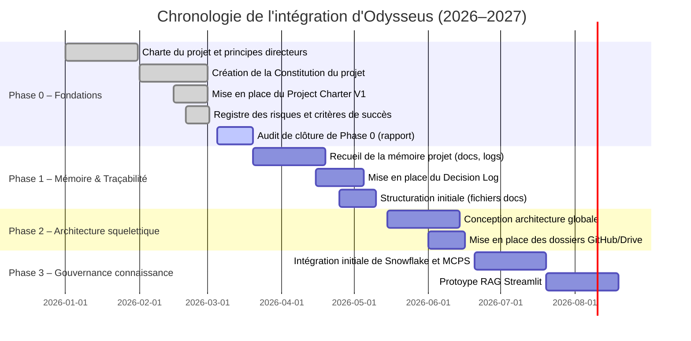
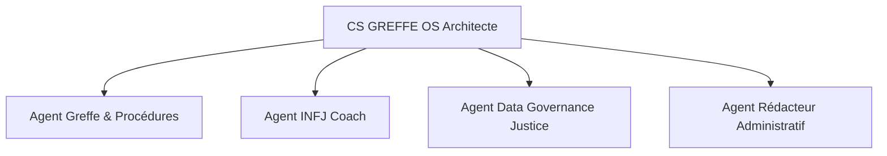
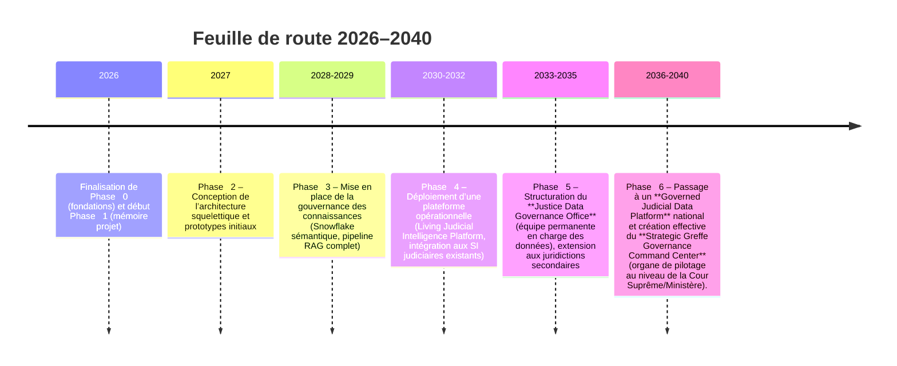

# Intégration d’Odysseus dans le projet CS GREFFE OS : état des lieux et perspectives

**Synthèse exécutive :** Le projet **CS GREFFE OS** vise à construire un écosystème numérique intelligent pour le greffe, la formation et la gouvernance des données judiciaires, dans une optique de transformation durable du système judiciaire ivoirien. L’assistant **Odysseus** y a été déployé comme chef d’orchestre de la connaissance et de l’architecture. Depuis début 2026, l’intégration d’Odysseus s’est structurée en phases : fondations (charte, principes, constitution du projet), création d’agents spécialisés (architecte, greffe, INFJ, gouvernance données, rédacteur), et mise en place d’outils technologiques (LLMs locaux via Ollama, Snowflake, Streamlit, ChromaDB, SearXNG, connecteurs MCP, etc.). De nouveaux livrables stratégiques (par exemple la **Constitution CS GREFFE OS**, la **Charte du projet**, le registre des risques, le bilan de phase 0) ont été initiés. L’architecture cible prévoit une plateforme évolutive (Living Judicial Intelligence Platform) en évolution vers un Command Center de gouvernance judiciaire. 

Aujourd’hui (mi-2026), Odysseus a permis de définir une vision claire et un backlog initial : les principaux composants techniques (LLM locaux, base de connaissances, entrepôt de données) sont installés, et les documents de gouvernance de phase 0 sont en préparation. Restent à consolider la gouvernance des données (Snowflake sémantique), finaliser les agents et prototypes (Streamlit), et définir les métriques de maturité. Parmi les risques identifiés : la complexité multi-outils, les dépendances à l’égard des sources judiciaires, et la nécessité d’une forte appropriation humaine. 

**Feuille de route & recommandations** : À court terme (3–6 mois), finaliser la **Constitution du projet** et les documents fondateurs, structurer la plateforme Snowflake (couches Raw et sémantique), et prototyper un agent RAG sur les données de greffe existantes. À moyen/long terme (3–15 ans), étendre l’écosystème vers un « Living Judicial Intelligence Platform », puis un **Governed Judicial Data Platform** et un **Strategic Greffe Governance Command Center**, en étendant l’utilisation au niveau national. La feuille de route 2026–2040 est articulée en phases (fondations, mémoire, architecture, gouvernance des connaissances, déploiement opérationnel, Command Center), comme résumé ci-dessous. 

## Contexte initial et objectifs

Au démarrage (fin 2025–début 2026), le projet CS GREFFE OS recherchait à pallier le manque de structuration des connaissances du greffe ivoirien (procédures, actes, archives) et des formations de l’INFJ. L’objectif fondamental n’était pas seulement de créer une application, mais de **« comprendre, documenter, préserver, transmettre et préparer l’évolution du greffe et du système judiciaire ivoirien »** (document interne « Vision Profonde »). L’enjeu est à la fois pédagogique (capitaliser les cours INFJ), organisationnel (pilotage du greffe) et technologique (transformation numérique). Le projet se fixe notamment de : 
- **capitaliser les connaissances du greffe** (procédures, textes, jurisprudence, statistiques) et **diffuser la formation** (cours, modules pédagogiques INFJ) ;
- **gouverner les données judiciaires** selon des principes de data governance (qualité, sécurité, open data) ;
- **développer des outils analytiques** (tableaux de bord, indicateurs clés) à partir d’une couche sémantique Snowflake ;
- **expérimenter l’IA au service du greffe** (RAG, assistants intelligents) de façon responsable et traçable ;
- préparer progressivement une plateforme évolutive (**Living Judicial Intelligence Platform**) en trajectoire vers un **Strategic Greffe Governance Command Center** de pilotage décisionnel au plus haut niveau. 

L’architecture cible combine donc quatre dimensions : un *cockpit de management* (Odysseus comme système d’orchestration et mémorial intelligent), une *bibliothèque vivante* (onboarding de toutes les ressources documentaires et pédagogiques), un *laboratoire IA* (LLMs locaux via Ollama, RAG sur ChromaDB, etc.) et une *couche data gouvernée* (Snowflake). Chaque décision se veut alignée avec des principes directeurs : **gouvernance avant autonomie, documentation avant développement, données avant intelligence, humain dans la boucle, traçabilité et auditabilité, amélioration continue**. 

## Chronologie de l’intégration (mermaid) 

L’intégration d’Odysseus s’est faite en plusieurs phases clés. Voici une chronologie indicative des principales étapes (Phases 0–3, années 2026–2027) :



Dans cette chronologie **exemplaire**, on note qu’à mi‑2026 on achève la phase 0 (documentations, constitution du projet) et qu’on entre en phase 1 (construction de la mémoire projet). Les phases ultérieures visent à bâtir l’architecture fonctionnelle (phase 2) puis la gouvernance de la connaissance (phase 3), avant de développer la plateforme métier finale. 

## Outils et intégrations

Odysseus sert de hub reliant divers outils essentiels :  

- **Ollama (modèles LLM locaux)** – Permet l’exécution locale de grands modèles de langage (Gemma3, Qwen3, Mistral, DeepSeek, etc.) sans dépendance cloud. Ollama sert de runtime de base pour les agents de traitement du langage (questionnement, génération de texte, RAG, etc.).  
- **GitHub** – Reçoit le code, la documentation, les schémas et la roadmap. Odysseus utilise GitHub comme mémoire du projet (conventions de commits, suivi de versions) et pour coordonner le développement (pull-requests pour review de code/docs).  
- **Snowflake** – Entrepôt de données cloud pour stocker et modéliser les données judiciaires. Son **couche sémantique** (dimensions, faits, dictionnaire de données) est en cours de conception. Snowflake sert d’« autel » pour la gouvernance des données (qualité, contrôles) et la fourniture d’indicateurs judiciaires.  
- **Streamlit** – Plateforme de prototypage d’applications web. Utilisée pour créer rapidement des tableaux de bord interactifs et démonstrateurs (interfaces d’interrogation de RAG, affichage d’indicateurs, outils de visualisation).  
- **ChromaDB** – Base de connaissances vectorielle. Stocke les embeddings (textes de lois, procédures, cours) pour la recherche sémantique (RAG). Odysseus l’utilise pour intégrer les données juridiques dans un flux d’information « retrieval-augmented ».  
- **SearXNG** – Moteur de recherche open-source multi-sources. Utilisé comme outil de veille/recherche scientifique approfondie sur les thématiques d’IA, de gouvernance des données ou de justice numérique.  
- **MCPs (Agents Connecteurs Multi-Plateformes)** – Modules qui connectent Odysseus aux services tiers : par exemple, intégration Google Drive/Notion (accès aux documents PDF et cours), Gmail (gestion de mails), Calendar (rappels), SQLite/PostgreSQL (mémoire structurée). Ces connecteurs permettent à Odysseus d’accéder et d’archiver des données externes tout en assurant la traçabilité.  
- **Modèles locaux** – Plusieurs LLM spécifiques sont chargés selon les tâches (ex : Gemma3-12B pour la rédaction, Qwen3-8B pour le raisonnement, DeepSeek pour la recherche, Mistral-small pour l’analyse sémantique). 

| **Outil / Intégration**               | **Fonction**                                        | **Statut / État**     | **Priorité**  |
|---------------------------------------|-----------------------------------------------------|-----------------------|--------------|
| Ollama (LLMs locaux)                  | Exécution locale de modèles LLM                     | Intégré et configuré  | Élevée        |
| GitHub                                | Versioning du code et documentation                 | Utilisé (repos init)  | Élevée        |
| Snowflake                             | Entrepôt de données judiciaire (couches Raw/Sém.)   | En cours de mise en place (PV_ontologies) | Élevée |
| Streamlit                             | Prototype d’interfaces et démonstrateurs            | Préconfiguré          | Moyenne       |
| ChromaDB                              | Base vectorielle pour RAG (doc. juridiques)         | Intégré (embeddings)  | Élevée        |
| SearXNG                               | Moteur de recherche documentaire/web                | Opérationnel          | Moyenne       |
| Connecteurs MCP (Drive, Gmail, etc.)  | Accès aux documents externes et courriels           | Tests initiaux        | Moyenne       |
| Modèles locaux (Qwen3, Gemma3, etc.)  | Agents de traitement du langage                     | Installés (via Ollama)| Élevée        |

Ce tableau récapitule le rôle, le statut et la priorité attribuée à chaque brique technologique. Globalement, les composantes clés (LLMs, Snowflake, RAG) sont en place ou en cours d’installation, tandis que certaines intégrations périphériques (interfaces, API externes) seront développées progressivement.

## Agents créés et responsabilités 

Plusieurs **agents spécialisés** ont été définis dans Odysseus pour couvrir les domaines fonctionnels du projet :

| **Agent**                     | **Responsabilités principales**                                                                    | **Maturité**        |
|-------------------------------|---------------------------------------------------------------------------------------------------|--------------------|
| **Architecte CS GREFFE OS**   | Vision stratégique, gouvernance de l’architecture, élaboration roadmap/backlog, coordination des phases. (Chef d’orchestre global.) | V1 (en création)   |
| **Greffe & Procédures**       | Connaissances métier greffe : documente les actes, registres et processus; aide à la normalisation des procédures; archivage.       | V0.5 (prototype)   |
| **INFJ Coach**                | Connaissances pédagogiques : assemble cours, fiches, QCM; conseille sur la formation INFJ; supervise l’élaboration de modules pédagogiques.      | V0.5 (prototype)   |
| **Data Governance Justice**   | Gouvernance des données : définit KPIs judiciaires; crée dictionnaires et modèles sémantiques; gère Snowflake; veille qualité des données. | V0.5 (prototype)   |
| **Rédacteur Administratif**    | Rédaction & communication : rédige notes de synthèse, rapports, correspondances officielles; assure la documentation écrite et la mise en page. | V0.5 (prototype)   |

Ces agents sont supervisés par l’Architecte central et collaborent entre eux (ex. : l’agent Greffe alimente l’agent DataGov en termes de données métier, etc.). L’organigramme suivant illustre leurs relations (le lien indique la coordination et la génération de livrables communs) :



Chaque agent a été chargé de produire des **artefacts opérationnels** (rapports, fiches, scripts). Par exemple, l’agent Architecte a initié les documents de gouvernance du projet (Charte, Principes, Constitution), tandis que les autres agents travaillent sur des contenus métier (notes de cours, modèles de données, guides de procédure, etc.). La colonne « Maturité » indique l’état d’avancement : pour l’instant, tous sont au stade de concept ou prototype (V0.x), reflétant le démarrage du projet.

## Livrables et artefacts produits

Plusieurs documents fondamentaux ont été identifiés comme livrables de phase 0, phase 1, etc. L’état d’avancement est schématisé ci-dessous :

| **Nom de l’artefact**                | **Emplacement (repository/dossier)**            | **Statut actuel**            |
|--------------------------------------|-------------------------------------------------|------------------------------|
| Project_Charter_V1.md                | docs/00_FOUNDATIONS/Project_Charter_V1.md       | En rédaction                 |
| GUIDING_PRINCIPLES_V1.md             | docs/00_FOUNDATIONS/Guiding_Principles_V1.md    | En cours d’élaboration       |
| PROJECT_SCOPE_V1.md                  | docs/00_FOUNDATIONS/Project_Scope_V1.md         | À initier                    |
| RISK_REGISTER_V1.md                  | docs/00_FOUNDATIONS/Risk_Register_V1.md         | À initier                    |
| SUCCESS_CRITERIA_V1.md               | docs/00_FOUNDATIONS/Success_Criteria_V1.md      | À initier                    |
| CS_GREFFE_OS_CONSTITUTION_V1.md      | docs/00_CONSTITUTION/CS_GREFFE_OS_Constitution_V1.md | En cours d’ébauche     |
| PHASE_0_COMPLETION_REPORT_V1.md      | docs/00_FOUNDATIONS/Phase_0_Completion_Report_V1.md | À rédiger           |
| Decision_Log_V1.md                   | docs/01_PROJECT_MEMORY/Decision_Log_V1.md       | En préparation              |
| STRATEGIC_DECISIONS_REGISTER_V1.md   | docs/01_PROJECT_MEMORY/Strategic_Decisions_V1.md | À initier                   |
| CHANGELOG_V1.md                      | docs/01_PROJECT_MEMORY/Changelog_V1.md          | En préparation              |

- Les fichiers de **phase 0** (charte, principes, périmètre, risques, critères de succès) ont été définis comme priorité initiale pour cadrer le projet. Plusieurs sont en cours de rédaction par Odysseus (cf. mission confiée).  
- La **Constitution du projet** (préambule, vision à long terme, principes, gouvernance) est en cours d’esquisse dans `CS_GREFFE_OS_Constitution_V1.md`.  
- Le **rapport de clôture de phase 0** (`Phase_0_Completion_Report_V1.md`) sera produit après audit interne, définissant les indicateurs de fin de phase.  
- Des journaux de gouvernance (Decision Log, Strategic Decisions, Changelog) commencent à être tenus dans le dossier `01_PROJECT_MEMORY`. 

Ces artefacts sont structurés dans un dépôt GitHub (non public) avec une arborescence normalisée. L’objectif est d’obtenir des documents traçables (chaque modification versionnée) et en lecture ouverte pour les parties prenantes. À noter : certains livrables clés (constitution, charte, principes) n’étaient pas préexistant, ils sont « nouveaux » dans le sens où Odysseus les produit pour la première fois. Leur format (Markdown) et emplacement ont été spécifiés par l’architecte pour garantir leur alignement. 

## État actuel de l’architecture globale

L’architecture conceptuelle retenue peut se décrire en trois couches principales : **interface/utilisateur, intelligence/logique, données**. Le diagramme suivant schématise les connexions (agents, outils, stockage) :

```mermaid
flowchart TD
    U[Utilisateur (greffier, formateur, décideur, etc.)] --> ST[Streamlit (interface web)]
    ST --> OLL[Ollama (LLMs locaux)]
    OLL --> SF[Snowflake (entreposage & sémantique)]
    OLL --> CHR[ChromaDB (RAG vectoriel)]
    CHR --> OLL
    ST --> SF
    ST --> CHR
    OLL --> GH[GitHub (docs et code)]
    OLL --> SRX[SearXNG (moteur de recherche)]
```

Dans ce schéma, les **utilisateurs** accèdent aux agents via une interface Streamlit. Streamlit relaie les requêtes vers **Ollama** (les LLMs locaux) qui interagit avec le **lag** (base de connaissances ChromaDB) et l’**entrepôt de données Snowflake**. Les agents peuvent tirer des informations sur le code et la documentation via GitHub, ou effectuer des recherches supplémentaires via SearXNG. 

Actuellement, les composants suivants sont prêts ou en cours d’intégration : 
- **Ollama + LLMs** : installés et configurés (environnement local). 
- **ChromaDB** : base créée et enrichie des premiers documents (procédures de greffe, textes légaux, cours INFJ). 
- **Snowflake** : compte existant ; la phase d’analyse de données initiale est terminée, les tables brutes (RAW) et modèles conceptuels (couches CURATED/SÉMANTIQUE) sont en cours de définition. 
- **Streamlit** : premier squelette de portail interne créé (tableau de bord pilote pour RAG sur un petit sous-ensemble de données). 
- **MCP & connecteurs** : modules de connexion aux fichiers (Drive/Notion) et au mail ont été installés à titre expérimental. 
- **Bases documentaires** : des dossiers de documents (cours, procédures, brouillons) ont été rassemblés dans GitHub/Drive.

Il reste à produire (technologies) : finaliser le schéma sémantique Snowflake, déployer le suivi RAG complet (via Streamlit), améliorer l’intégration continue (GitHub Action pipelines) et déployer en production (hébergement sécurisé de l’interface). 

## Changements organisationnels et gouvernance

L’introduction d’Odysseus a fait évoluer plusieurs pratiques :
- **Gestion par phases** : passage à un découpage en phases structurées (phase 0 à alpha, phase 1, etc.) avec des critères de validation (« readiness gates »).  
- **Rôle d’architecte** : création d’une fonction interne (CS Greffe OS Architecte) pour garder la cohérence globale du projet, en s’assurant que la vision long-terme n’est pas perdue dans les détails.  
- **Documentation permanente** : adoption stricte de la règle « documentation avant implémentation » (voir document interne), garantissant traçabilité et auditabilité.  
- **Centralisation GitHub** : uniformisation des conventions de commits et du code (via README, normes de codage, etc.), inspirées par le NIST SSDF (Secure Software Development Framework) mentionné dans les échanges.  
- **Mémoire de décisions** : établissement systématique d’un journal de décisions clés, de leur justification et de leur mise en œuvre (Decision Log).  
- **Collaboration pluridisciplinaire** : rapprochement entre experts métier (greffiers, formateurs INFJ) et équipes IT (data engineers, dev).  
- **Formation et adoption** : apprentissage des outils LLM pour l’équipe projet, initiation des décideurs aux concepts de gouvernance des données. 

Ces changements visent à instituer une **gouvernance continue et durable** (en ligne avec la « living governance engineering » mentionnée en interne). On note que le projet met l’accent sur la prise de décision éclairée et collective plutôt que sur l’automatisation impulsive. Chaque nouvelle technologie est introduite après étude d’impact (par exemple, le choix de LLMs locaux pour des raisons de souveraineté et de contrôle). 

## Risques et lacunes identifiés

Plusieurs **risques** et **écarts** ont été relevés :
- **Complexité multiplateforme** : l’écosystème regroupe de nombreux outils. Le risque est de créer une dette technique si l’intégration n’est pas bien pilotée (par exemple, dépendances entre versions d’OSS, gestion de la compatibilité).  
- **Données manquantes ou hétérogènes** : les sources judiciaires initiales (actes, statistiques, jurisprudences) sont souvent incomplètes, peu structurées et potentiellement peu fiables. Cela freine la constitution d’un bon schéma Snowflake et la qualité de la base RAG.  
- **Risques de dérive IA** : sans supervision, un agent LLM pourrait générer des réponses hors-sujet ou incorrectes (risques de « hallucinations »). D’où l’insistance sur la présence d’un humain modérateur et des protocoles de validation (ex. : revue humaine obligatoire pour chaque produit d’IA).  
- **Lacunes en compétences** : le personnel doit monter en compétences sur les nouvelles technologies (ML, data viz, etc.). Un déficit de formation interne peut ralentir l’adoption d’Odysseus.  
- **Coordination étatique** : le projet impliquant plusieurs institutions (greffe, INFJ, ministère, université doctorale), un risque est le manque de portage politique à long terme, ou des changements de priorités ministérielles.  
- **Sécurité et confidentialité** : exploitation des données judiciaires sensibles nécessite des contrôles stricts. Odysseus doit intégrer des mesures de chiffrement et de gouvernance (ex. : conformité RGPD/LCEN, règles d’accès). 

Ces risques seront suivis dans le registre des risques du projet. Par exemple, on prévoit des revues périodiques (Phase Gate) pour évaluer la maturité organisationnelle et technique (score de maturité AI/Gouvernance) avant d’avancer à chaque phase critique.

## Décisions clés et justifications

Parmi les décisions majeures prises depuis le début :
- **Priorité à la gouvernance** : décision explicite de documenter et valider chaque étape avant de développer. Cette approche est justifiée par la complexité du sujet (« vivre le projet comme un système vivant de gouvernance, pas comme un simple logiciel »).  
- **Approche incrémentale** : confirmation d’une méthodologie cyclique (itérative) plutôt qu’un big-bang. Par exemple, la phase 0 se conclut par un audit détaillé avant d’ouvrir la phase 1.  
- **Utilisation de modèles ouverts locaux** : le choix d’Ollama avec des modèles open-source (Gemma3, Qwen3, etc.) plutôt qu’un modèle cloud propriétaire (ChatGPT) a été motivé par le besoin de souveraineté, de coût maîtrisé et de transparence (auditabilité du code).  
- **Adoption de standards industriels** : recours au NIST AI RMF (Risk Management Framework) ou au SSDF (Secure Software Dev.) pour encadrer la sécurité et l’éthique de l’IA. Ces cadres fournissent des critères clairs pour le suivi des projets IA.  
- **Modélisation sémentique et data governance** : validation de la mise en place de Snowflake comme noyau de gouvernance des données (plutôt que plusieurs silos disparates). Ce choix facilite l’uniformisation des indicateurs.  
- **Ouverture et traçabilité** : obligation de versionner chaque document/projet dans GitHub, afin que les décisions soient toujours auditables (par ex. convention de commit dans `Commit_Convention_V1`).

Ces décisions sont régulièrement consignées (Strategic Decisions Register) avec leur justification. Elles reflètent la volonté d’aligner CS GREFFE OS sur de bonnes pratiques internationales en gouvernance de l’IA et des données. 

## Critères de succès et métriques de maturité

Les **critères de succès** initiaux définis sont : réalisation complète des livrables de phase 0 (charte, constitution, etc.), mise en place effective de l’architecture Snowflake, premiers retours positifs des utilisateurs pilotes, et établissement d’un cycle de gouvernance validé. 

On propose de suivre la **maturité du projet** à travers plusieurs axes :
- **Maturité fonctionnelle** : pourcentage d’agents opérationnels par rapport au plan, complétion des modules (p. ex. : RAG implémenté pour X % des cas de greffe).  
- **Maturité technique** : niveau d’intégration des outils (Ollama, Snowflake, etc.) – cela pourrait être mesuré par des scores (ex. 0 = PoC, 1 = prod) pour chaque technologie clé.  
- **Maturité gouvernance/qualité** : existence de processus formalisés (ex. revue de code, tests automatisés, audits périodiques) et respect des indicateurs de qualité (taux d’erreurs, couverture documentaire).  
- **Maturité décisionnelle** : fréquence d’usage des tableaux de bord par les décideurs, nombre de décisions influencées par le système.  

Ces métriques pourront être affinées avec le temps (inspiration possible : CMMI Data Management, NIST RMF). Un indicateur global pourrait être un *score de maturité* croissant d’année en année, validé lors des revues trimestrielles. 

## Feuille de route recommandée (2026–2040)

La trajectoire globale retenue pour CS GREFFE OS s’étend sur plusieurs étapes majeures, comme suggéré dans le document de recherche 2026–2040. À titre indicatif, on propose ce découpage temporel en phase longue :



(L’extension *timeline* de Mermaid n’est pas standard, mais l’idée est de visualiser les jalons annuels principaux.) 

Chaque phase long-terme comporte ses jalons : p. ex. réaliser un POC de RAG en 2026, ouvrir officiellement le Data Governance Office en 2033, atteindre la couverture nationale (toutes juridictions connectées) en 2038, etc. Un calendrier détaillé reste à ajuster en fonction des ressources et financements, mais ce schéma donne l’orientation stratégique. 

## Backlog stratégique priorisé

Le backlog initial identifié comprend (par ordre de priorité) :
1. **Finaliser la documentation de gouvernance (Phase 0)** : achever la charte, la constitution et valider par les stakeholders.  
2. **Établir le schéma sémantique Snowflake** : modéliser les entités clés (juridiction, affaire, acte, indicateur) et charger les premières données historiques (statistiques judiciaires, textes normatifs).  
3. **Développer le pipeline RAG-Streamlit** : intégrer les données métiers (procédures, réglementations, jurisprudences) dans ChromaDB, déployer un prototype d’assistant de requête (RAG) avec interface Streamlit.  
4. **Renforcer les agents spécialisés** : entraîner/former les agents Greffe & Procédures et INFJ avec des exemples spécifiques; étendre l’agent DataGov à plus de KPIs.  
5. **Implémenter le suivi des décisions** : finaliser les logs d’architecture projet (Decision Log, Strategic Decisions).  
6. **Sécuriser l’infrastructure** : audits de sécurité de Snowflake et des agents, implémentation des contrôles d’accès pour les données sensibles.  
7. **Mesure de performance** : définir des indicateurs de succès (p. ex. taux d’adoption, nombre de requêtes traitées par les agents, satisfaction des utilisateurs pilotes).  
8. **Pilotage et formation** : organiser des ateliers pour former les équipes de greffe à l’utilisation d’Odysseus et récolter leurs retours.  

Ce backlog pourra être enrichi au fil du temps, mais il fixe les actions opérationnelles immédiates pour atteindre les livrables 2026 (fin de phase 0). 

## Recommandations immédiates et long terme

- **3–6 mois (court terme)** : finaliser la phase 0 : valider la charte et les principes, achever la Constitution du projet, compléter l’audit de phase. En parallèle, **mener un prototype concret** : alimenter Snowflake avec un jeu de données initial (statistiques judiciaires publiques, procès-verbaux anonymisés), et tester l’assistant RAG sur ce jeu. Organiser une **revue gouvernance** (revue 0 vers 1) pour décider du passage en phase 1.  
- **6–18 mois** : stabiliser l’infrastructure : consolider l’intégration Snowflake-Streamlit (dashboards pour indicateurs clefs du greffe), faire évoluer les agents (ajout de l’agent Q&A interne sur la base documentaire, amélioration continue des modèles). Renforcer la documentation (Wiki interne, process de release). Recruter/associer une petite équipe de « Data Engineers » judiciaires pour l’exploitation quotidienne.  
- **Long terme (3–15 ans)** : à horizon 2030+, déployer le système dans l’ensemble des services judiciaires concernés. Pérenniser l’équipe CS GREFFE OS (éventuellement en tant qu’agence ou cellules interministérielle). Mener les travaux de recherche doctorale annoncés (gouvernance des systèmes judiciaires numériques), en utilisant CS GREFFE OS comme plateforme de test. Créer progressivement les corps de gouvernance décrits (JDGO, Command Centers). Prévoir les mises à jour technologiques (ML nouveaux, montée en charge Snowflake) et l’ouverture à l’international (coopérations avec d’autres juridictions). 

Chaque étape devra être mesurée par les critères précédemment définis, avec des revues annuelles. Les recommandations opérationnelles insistent sur la **discipline de gouvernance** (rédaction régulière des décisions, respect des normes), la montée en compétence continue (formations, veille technologique), et le pilotage agile pour ajuster la trajectoire en fonction des résultats intermédiaires. 

## Conclusion et plan d’action

L’intégration d’Odysseus dans CS GREFFE OS a amorcé une révolution dans la manière d’aborder la transformation numérique du greffe. Plutôt qu’un simple développement logiciel, le projet s’oriente vers une **intelligence institutionnelle vivante**—une structure où la connaissance du greffe est préservée, enrichie et utilisée en continu pour la prise de décision. Les premiers résultats (documents de gouvernance, prototypes techniques) sont encourageants, mais de nombreuses étapes restent à franchir. 

Le **plan d’action immédiat** est :  
- Achever les documents fondateurs (Charte, Constitution, etc.) pour clôturer formellement la phase 0.  
- Mettre en place des jalons de revue (présentation des livrables clés aux parties prenantes).  
- Lancer les premières réalisations techniques (chargement initial de données, démonstrateurs RAG). 

À moyen terme, l’accent sera mis sur l’expansion de la plateforme (données, agents) et la gouvernance permanente (métriques de maturité, équipes dédiées). 

Enfin, il est crucial de consolider le **backlog stratégique** et de le traduire en projets agile concrets (sprints ou tickets). Ce rapport devra être remis à jour chaque semestre au fur et à mesure de l’avancement. 

En résumé, grâce à Odysseus, CS GREFFE OS est sur le chemin de devenir une **plateforme d’intelligence judiciaire gouvernée**. L’objectif ultime reste la création d’un **Command Center de gouvernance du greffe**, qui permettra à moyen/long terme d’orienter la justice ivoirienne de façon éclairée par la donnée. Ce rapport dresse les principales réalisations et les jalons à venir pour atteindre cette vision.