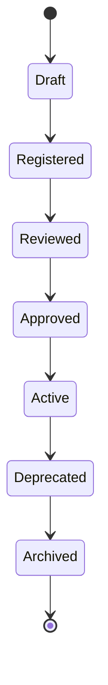

# State Transitions — LDGP

Generic LDGP lifecycle:

Draft → Registered → Reviewed → Approved → Active → Deprecated → Archived

## Transition Rules

- Each transition requires documented validation.
- No object can skip the Approved state to become Active.
- Archived objects cannot be reactivated without a new Draft cycle.
