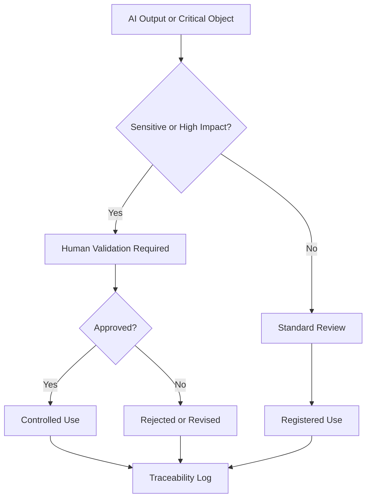

# Human Validation Model

Human validation is mandatory when an output can influence operational, legal, institutional, ethical, or sensitive decisions.

## Minimum Validation Evidence

- validated object
- validator
- validation date
- validation decision
- validation scope
- reason for rejection if rejected
- Traceability Log
